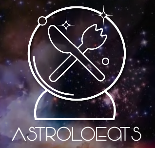

# 

Get food reccomendations based on your daily horoscope. Using [IBM Watson's Tone Analyzer](https://www.ibm.com/watson/developercloud/tone-analyzer.html) and [The Astrologer API](https://github.com/sandipbgt/theastrologer-api), AstroloEats extracts the dominant emotional tones of your horoscope and suggests restaurants based on that information.

## Usage
AstroloEats is currently hosted on Expo! 

[Click here](https://expo.io/@ariskoumis/astroloeats) to access the app.

## Built with Expo

- [Expo](https://expo.io/) - *Write Android & iOS apps in JS*

## Created by Aris Koumis
